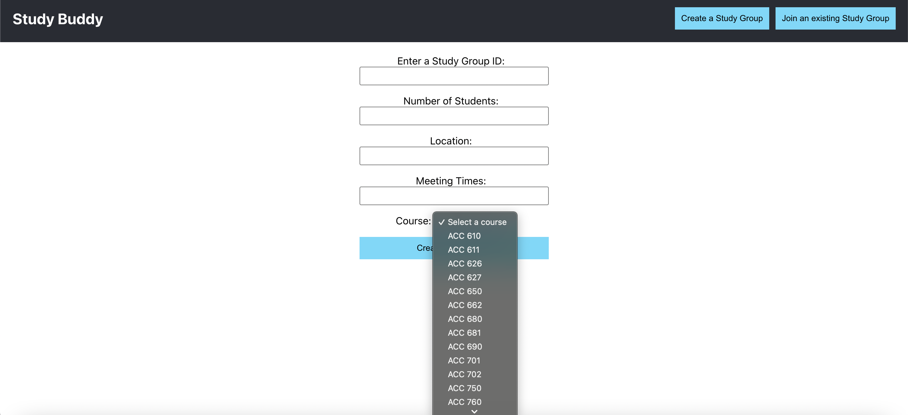

Study Buddy - University of Waterlo

Overview

Study Buddy is a platform designed for students at the University of Waterloo, leveraging the university's Open Data API to facilitate connections among students. By providing easy access to course information, the platform helps users find study partners who are enrolled in the same courses, fostering collaboration and enhancing the academic experience.

Features

Course Information: Fetches real-time data about courses offered at the University of Waterloo using the Open Data API.
Study Buddy Matching: Allows students to find peers based on shared courses, making it easier to form study groups.
User-Friendly Interface: Designed with a clean and intuitive interface to streamline the process of finding a study buddy.
Real-Time Updates: Ensures that users have access to the most current course information and availability.

Here is our progress so far:-

